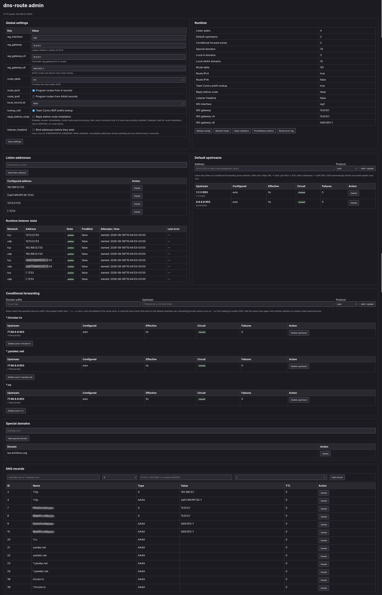

# dns-route

[English version](README.md)

`dns-route` — DNS-прокси для Linux, который превращает выбранные DNS-ответы в динамические маршруты. Демон умеет пересылать DNS по UDP, TCP, DNS-over-TLS и DNS-over-HTTPS, отвечать локальными A/AAAA-записями, загружать списки доменов из CSV-файлов и URL, а также создавать Linux- или BGP-маршруты к адресам выбранных доменов.

Основной сценарий — раздельная маршрутизация, когда через туннель, отдельный шлюз или внешний маршрутизатор должны идти только определённые домены.

```text
DNS-запрос клиента
       |
       v
+-------------+       +----------------------------+
|  dns-route  | ----> | основной или зональный DNS |
+-------------+       +----------------------------+
       |
       +-- локальный A/AAAA или NODATA-ответ
       |
       +-- совпадение со специальным доменом
               |
               +-- необязательный поиск префикса Team Cymru
               |
               +-- маршрут Linux / анонс встроенного GoBGP
```



## Возможности

- Несколько IPv4- и IPv6-адресов прослушивания одновременно по UDP и TCP.
- Повторная привязка listener'ов, если интерфейс появляется после запуска демона.
- Необязательное использование Linux `IP_FREEBIND`/`IPV6_FREEBIND`.
- Основные upstream DNS и условная пересылка по наиболее длинному доменному суффиксу.
- Upstream по UDP, TCP, DoT и DoH с проверкой TLS-сертификатов.
- Приоритеты upstream, случайный выбор внутри одного приоритета, fallback UDP → TCP и circuit breaker при ошибках.
- Кэш положительных DNS-ответов с ключом по полному запросу и корректным уменьшением TTL.
- Постоянные локальные A/AAAA-записи, wildcard-записи, несколько адресов и явные правила NODATA.
- Постоянные и внешние CSV-источники специальных доменов и локальных DNS-записей.
- Создание маршрутов из A- и AAAA-ответов только для выбранных специальных доменов.
- Необязательное определение агрегированного BGP-префикса через DNS TXT Team Cymru.
- Режимы маршрутизации: ядро Linux, встроенный GoBGP или `kernel+bgp`.
- Режим ответа до установки маршрута с асинхронной установкой и сбросом conntrack после появления нового kernel-маршрута.
- Транзакционная конфигурация в SQLite и встроенная web-панель.
- Страницы состояния, статистика, диагностика маршрутов и метрики Prometheus.
- Корректное завершение по `SIGINT` и `SIGTERM`.

## Быстрый запуск

Требования: Linux и Go версии 1.23 или новее.

```bash
go mod download
go test ./...
go build -o dns-route .

sudo install -Dm755 dns-route /usr/bin/dns-route
sudo mkdir -p /var/lib/dns-route
sudo /usr/bin/dns-route \
  -db /var/lib/dns-route/config.db \
  -http 127.0.0.1:8080
```

Откройте `http://127.0.0.1:8080`, после чего:

1. Добавьте хотя бы один DNS listener, например `127.0.0.1:53`.
2. Добавьте основной upstream, например `1.1.1.1:53` с протоколом `udp`.
3. Укажите интерфейс, шлюзы, таблицу и семейства маршрутизации.
4. Добавьте специальные домены, адреса которых нужно маршрутизировать.

Для каждого адреса прослушивания создаются одновременно UDP- и TCP-listener.

> [!WARNING]
> Во встроенной HTTP-панели пока нет собственной аутентификации и TLS. Привязывайте её к loopback либо закрывайте firewall'ом и доверенным reverse proxy с авторизацией.

## Документация

| Раздел | Русский | English |
|---|---|---|
| Сборка, установка, systemd и обновление | [Сборка и установка](docs/build-install.rus.md) | [Build and installation](docs/build-install.md) |
| CLI, SQLite, listener'ы, upstream, маршруты и BGP | [Описание параметров](docs/configuration.rus.md) | [Configuration reference](docs/configuration.md) |
| Варианты использования с AmneziaWG и Xray | [AmneziaWG и Xray](docs/amneziawg-xray.rus.md) | [AmneziaWG and Xray](docs/amneziawg-xray.md) |
| Импорт специальных доменов и DNS-записей | [Импорт доменов](docs/domain-import.rus.md) | [Domain import](docs/domain-import.md) |

## Web endpoints

| Путь | Назначение |
|---|---|
| `/` | Runtime-состояние и состояние route backend'ов |
| `/settings` | Listener'ы и параметры маршрутизации |
| `/upstreams` | Основные upstream и зоны условной пересылки |
| `/special-domains` | Домены, DNS-ответы которых запускают маршрутизацию |
| `/dns-records` | Локальные A/AAAA/NODATA-записи и внешние источники |
| `/statistics` | Счётчики, очереди и состояние circuit breaker |
| `/metrics` | Метрики в формате Prometheus |
| `/routes/errors` | Последние ошибки kernel-маршрутов в JSON |

## Как выбираются маршруты

Маршрут обрабатывается только при одновременном выполнении условий:

- имя запроса совпало с шаблоном специального домена;
- тип запроса — `A` или `AAAA`;
- маршрутизация соответствующего семейства включена;
- DNS-ответ содержит адрес запрошенного семейства.

При `lookup_cidr=1` dns-route запрашивает Team Cymru и использует покрывающий префикс, если он найден. При ошибке или отсутствии подходящего префикса используется `/32` для IPv4 либо `/128` для IPv6.

`route_table=0` означает основную таблицу Linux `254`. Для split routing обычно безопаснее отдельная policy-routing таблица: она меньше зависит от посторонних маршрутов, уже находящихся в main table.

## Лицензия

См. [LICENSE](LICENSE).
